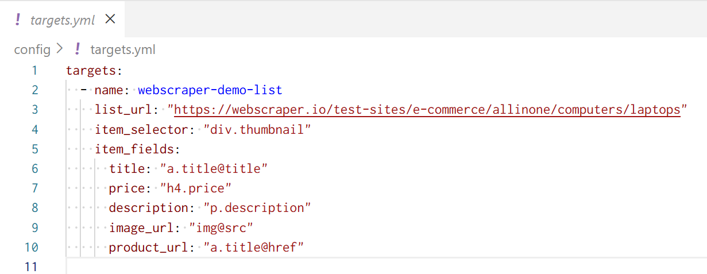
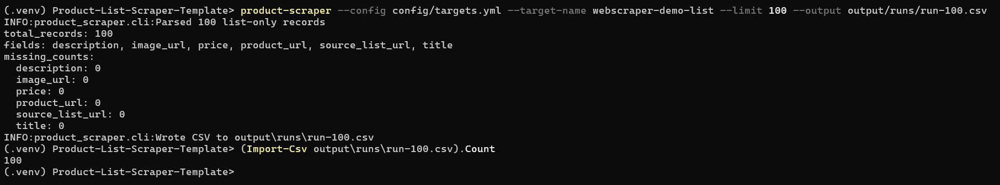
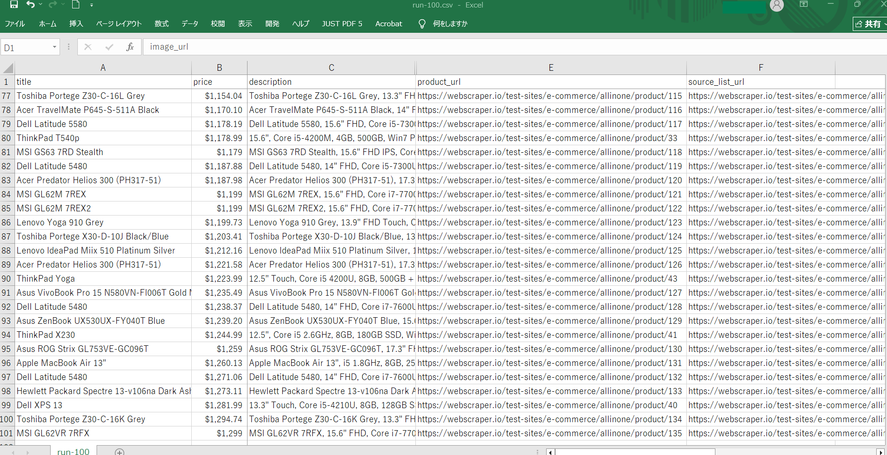

# Product-List-Scraper-Template

[](https://github.com/ryuhei-py/Product-List-Scraper-Template/actions/workflows/ci.yml)

[](LICENSE)

A config-driven Python web scraping template for extracting product data from:
- **Listing pages only** (list-only mode), or
- **Listing pages + product detail pages** (list → detail mode)

Designed for real-world delivery: configuration validation, deterministic tests (no live network required), CI checks, an offline demo mode, and operational controls for responsible scraping.

---

## Demo Screenshots

* Demo Screenshots

| Config (target definition) | CLI run (scrape 100 items) | Output preview (CSV) |
| --- | --- | --- |
|  |  |  |

> Demo shown uses a public test site (webscraper.io). Replace with permitted sources for real work.

---

## Table of Contents

- [Highlights](#highlights)
- [What It Produces](#what-it-produces)
- [Quickstart](#quickstart)
- [Setup](#setup)
- [Install](#install)
- [Configuration](#configuration)
  - [Targets (Two Modes)](#targets-two-modes)
  - [Selector spec cheatsheet](#selector-spec-cheatsheet)
- [Usage Examples](#usage-examples)
- [Settings (Operational Controls)](#settings-operational-controls)
- [Architecture](#architecture)
- [Testing & CI](#testing--ci)
- [Responsible Use](#responsible-use)
- [Extending the Template](#extending-the-template)
- [Project Structure](#project-structure)
- [Related Documentation](#related-documentation)
- [License](#license)

---

## Highlights

- **YAML-driven targets**: adapt to new sites primarily by editing selectors and URLs.
- **Two supported modes**:
  - list-only scraping (single page fetch)
  - list → detail scraping (follow links and enrich data)
- **Config validation**: fails fast on invalid targets/settings before running the pipeline.
- **Deterministic testing**: test suite avoids live network dependency.
- **Offline demo mode (`--demo`)**: proves the end-to-end pipeline using local HTML fixtures.
- **Operational controls**: timeout, attempts, retry backoff/jitter, politeness delay, configurable User-Agent.
- **Quality reporting**: missing-field counts per run to spot regressions early.
- **CI quality gates**: ruff + pytest enforced in GitHub Actions.

---

## What It Produces

### Primary output
- **CSV** written by the CLI.

> Note: JSON/Excel export helpers exist in `src/product_scraper/exporter.py`, but the CLI’s default output path is CSV.

### Traceability fields added by the pipeline
- `source_list_url` (always)
- `detail_url` (list → detail mode only)

### URL normalization rule
Any field whose name ends with `*_url` is treated as URL-like and normalized to an absolute URL using the page URL as the base.

A sample output is included in: `sample_output/products.sample.csv`

---

## Quickstart

The fastest, safest way to verify the project end-to-end is the **offline demo** (no network access required):

```bash
product-scraper --demo --output sample_output/products.demo.csv
````

---

## Setup

This section is a practical, reproducible setup flow for local development and real runs.

### 1) Clone the repository

```bash
git clone https://github.com/ryuhei-py/Product-List-Scraper-Template.git
cd Product-List-Scraper-Template
```

### 2) Create and activate a virtual environment

**macOS / Linux**

```bash
python -m venv .venv
source .venv/bin/activate
python -m pip install --upgrade pip
```

**Windows (PowerShell)**

```powershell
python -m venv .venv
.\.venv\Scripts\Activate.ps1
python -m pip install --upgrade pip
```

### 3) Install the package

```bash
pip install -e .
```

If your environment uses extras for development tooling, you can also install:

```bash
pip install -e ".[dev]"
```

### 4) Prepare configuration files

Targets are passed via `--config`. Settings are read from `config/settings.yml`.

Recommended starting point:

```bash
cp config/targets.example.yml config/targets.yml
cp config/settings.example.yml config/settings.yml
```

On Windows (PowerShell):

```powershell
Copy-Item config\targets.example.yml config\targets.yml
Copy-Item config\settings.example.yml config\settings.yml
```

### 5) Verify the pipeline offline

```bash
product-scraper --demo --output sample_output/products.demo.csv
```

### 6) Run against a real target

Edit `config/targets.yml` to match your target site (selectors + URLs), then run:

```bash
product-scraper --config config/targets.yml --target-name <TARGET_NAME> --limit 20 --output output/runs/run.csv
```

If you want to validate config/selector changes without writing a file:

```bash
product-scraper --config config/targets.yml --target-name <TARGET_NAME> --limit 5 --dry-run
```

> Important: `--dry-run` still fetches and parses; it only skips writing the output file.

---

## Install

### Prerequisites

* Python 3.11+
* pip

### Install (editable)

From the repository root:

```bash
pip install -e .
```

---

## Configuration

This template is driven by a **targets YAML** passed via `--config`. Each target is a “scraping recipe” (URL + selectors).

For full details, see: `docs/CONFIG_GUIDE.md`

### Targets (Two Modes)

Targets file shape:

* Top level: `targets: [...]`
* Each target must include:

  * `name`
  * `list_url`
  * plus the keys required by one of the modes below

#### Mode A: List-only (extract items from a listing page)

Required keys:

* `item_selector` (CSS selector for each product card)
* `item_fields` (mapping of `field_name → selector_spec`)

Example:

```yaml
targets:
  - name: my-shop
    list_url: "https://example.com/products"
    item_selector: "div.product-card"
    item_fields:
      title: "a.title@title"
      price: "span.price"
      description: "p.description"
      image_url: "img@src"
      product_url: "a.title@href"
```

#### Mode B: List → detail (follow links and enrich fields)

Required keys:

* `link_selector` (CSS selector for product links on the listing page)
* `detail_selectors` (mapping of `field_name → selector_spec` parsed from each detail page)

Example:

```yaml
targets:
  - name: my-shop-detail
    list_url: "https://example.com/products"
    link_selector: "a.title"
    detail_selectors:
      title: "h1.product-title"
      price: "span.price"
      description: "div.description"
      image_url: "img.main@src"
      product_url: "link[rel='canonical']@href"
```

### Selector spec cheatsheet

Supported selector patterns:

* **Text** (default):

  * `span.price`
  * `span.price::text` (explicit text form; optional)

* **Attribute extraction**:

  * `a.title@href`
  * `a.title::attr(href)` (equivalent form)

If an element does not exist (or extracted text is empty), the value becomes `null/None` and will appear as an empty cell in CSV.

---

## Usage Examples

### 1) List-only scraping → CSV

```bash
product-scraper \
  --config config/targets.yml \
  --target-name my-shop \
  --limit 20 \
  --output output/runs/my-shop.csv
```

### 2) List → detail scraping (enriched records)

```bash
product-scraper \
  --config config/targets.yml \
  --target-name my-shop-detail \
  --limit 10 \
  --output output/runs/my-shop-detail.csv
```

### 3) Validate without writing output

`--dry-run` still fetches and parses; it only skips writing the output file.

```bash
product-scraper \
  --config config/targets.yml \
  --target-name my-shop \
  --limit 5 \
  --dry-run
```

### 4) Offline demo (no network)

```bash
product-scraper --demo
```

---

## Settings (Operational Controls)

Runtime settings are read from `config/settings.yml` (copy from `config/settings.example.yml`).

Key options include:

* **HTTP**

  * `timeout`
  * `max_retries` (max attempts)
  * `delay_seconds` (politeness delay between detail requests)
  * `retry_backoff_seconds`, `retry_backoff_multiplier`, `retry_jitter_seconds`
  * `user_agent`

* **Validation / Quality reporting**

  * `validation.enabled` (enable/disable missing-field report)

* **Logging**

  * `logging.level`

* **Output defaults**

  * `output.directory`
  * `output.csv_filename`

Operational guidance: `docs/operations.md`

---

## Architecture

Pipeline (high level):

**fetch → parse → normalize → validate/report → export**

* **CLI** (`src/product_scraper/cli.py`): orchestrates config loading, settings, and execution.
* **Config** (`src/product_scraper/config.py`): loads YAML and validates target schema.
* **Fetcher** (`src/product_scraper/fetcher.py`): HTTP fetch with retry/backoff, plus file fetcher for offline demo/tests.
* **Parser** (`src/product_scraper/parser.py`): BeautifulSoup parsing + selector spec engine.
* **Validator** (`src/product_scraper/validator.py`): missing-field counting and reporting.
* **Exporter** (`src/product_scraper/exporter.py`): CSV export used by CLI (plus JSON/Excel helpers).

Full details: `docs/architecture.md`

```mermaid
flowchart LR
  A[CLI] --> B[Load targets.yml + validate]
  A --> C[Load settings.yml]
  A --> D[Fetch list page]
  D --> E[Parse list-only items OR extract detail links]
  E --> F[Fetch & parse detail pages (optional)]
  F --> G[Normalize *_url + add traceability fields]
  G --> H[Quality report (optional)]
  H --> I[Export CSV (unless --dry-run)]
```

---

## Testing & CI

### Run locally

```bash
python -m ruff check src tests
python -m pytest
```

### What the tests cover (high signal)

* Target/settings config validation
* Parser correctness for both modes (including selector spec behavior)
* Fetcher retry/backoff behavior (mocked)
* Exporter correctness (CSV and helper exporters)
* CLI smoke tests using mocked fetchers and/or offline fixtures

Testing guide: `docs/testing.md`

### CI

GitHub Actions runs:

* ruff
* pytest

---

## Responsible Use

This project is built to support responsible scraping, but compliance depends on the operator and the target site:

* Review and comply with the target site’s Terms of Service and policies.
* Use conservative request rates (enable delays; keep retries reasonable).
* Do not bypass access controls or anti-bot protections.
* Avoid collecting personal data unless you have explicit authorization and a lawful basis.
* Keep secrets out of outputs/logs; prefer `.env` and environment variables for sensitive values.

See: `docs/SECURITY_AND_LEGAL.md`

---

## Extending the Template

This repository is intentionally modular. Common extensions include:

* **Add a new site**: create a new target entry in `targets.yml`.
* **Pagination**: iterate list pages or follow “next page” links.
* **Persistence**: store outputs to SQLite/Postgres/S3; enable incremental runs.
* **Notifications**: alert on failures, empty runs, or quality regression.
* **Output formats**: wire JSON/Excel helpers into CLI flags if needed.
* **Concurrency**: add bounded parallel detail fetches (with politeness constraints).

---

## Project Structure

```text
.
├── config/                # example targets/settings
├── docs/                  # architecture/config/ops/testing/legal
├── fixtures/              # offline HTML for demo/tests
├── sample_output/         # sample CSV outputs
├── src/product_scraper/   # CLI + pipeline modules
├── tests/                 # pytest suite
└── .github/workflows/     # CI (ruff + pytest)
```

---

## Related Documentation

* `docs/architecture.md` — component breakdown, pipeline flow, and design rationale
* `docs/CONFIG_GUIDE.md` — targets schema, selector spec, and settings reference
* `docs/operations.md` — operational guidance (running safely, scheduling, monitoring)
* `docs/testing.md` — local testing workflow and what the suite validates
* `docs/SECURITY_AND_LEGAL.md` — responsible use, compliance considerations, and operator guidance

---

## License

MIT (see `LICENSE`)